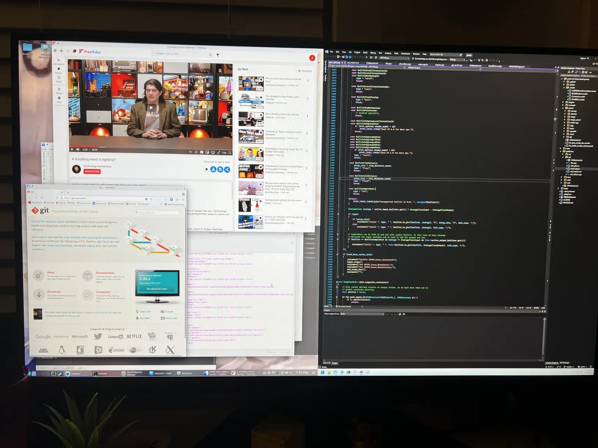

It's uh, been a while since the last Prism changelog :-) Haha, well there's as always a ton of interesting changes to go over!

<!--more-->

### To WebGPU and no WebGPU

If you've been paying attention to [my](https://git.sr.ht/~redstrate/prism/commit/a0d92be759450f09343bb04f4da913ccef505bbd) [recent](https://git.sr.ht/~redstrate/prism/commit/3229c4fa2cbb294e6af18649ce826831cd85eada) [commits](https://git.sr.ht/~redstrate/prism/commit/0a95ee2fa8fbf23ba8b3a17c78d6d3dc35ecfcd9), you'll see that I have done a ton of work to support WebGPU, but now I'm probably going to be reverting those changes - for a [myriad of reasons](https://knockout.chat/thread/21724/37#post-1210400).

First, I'm not a huge fan of the opinionated sense of the WebGPU design at all. From WGSL to weird decisions to omit some common API features such as push/root constants did not mix well with me. Is it weird to say that it actually might be easier to port Prism to WebGL? _Is it?_

It wasn't until I realized that I'm pulling apart my engine for no good reason just to support WebGPU that I realized it's not worth it. Maybe if I had designed the engine from the start to support it, things would've turned out differently, but unfortunately I'm not convinced this is a part of Prism's future. For now, I'm going to refocus my efforts on the usual desktop-class graphics APIs.

### DirectX12 support has begun

I recently was able to get a [nice Windows setup going](https://knockout.chat/thread/25747/28#post-1207745), so now DX12 support is going to finally begin. This is one of the last APIs I plan to support officially, so this is exciting. Now I don't have any real excuse to not support this API.



### Moving away from Objective-C

In an effort to reduce my usage of Objective-c in the Metal backend, the whole backend is now C++ and uses metal-cpp which is Apple's official C++ wrapper. It works pretty great, and now my static analysis tools work great with it too.

### Move to sourcehut
Prism now is primarily hosted on sourcehut, with mirrors on GitHub and ryne.moe. This is a pretty important goal for reducing my need on centralized services, and I'll be putting in some work to move off of GitHub wiki as well - just like I did with astra.

### Multiple GFX support
There is now support for using more than one GFX backend (although not at the same time), and is now supported by the SDL backend and the offline shader compiler will automatically pick out which shader files to compile for you. This is important, as some platforms are now capable of using more than one. Right now, the priority is as follows:

```
DirectX12 -> Metal -> Vulkan -> Dummy
```

Of course, this is only if the platform supports those APIs, and it's significantly shorter in the real world. And of course, you can override these at runtime with flags like `-vulkan` or `-metal`.

### Vulkan is now a first-class GFX backend
You've seen that Vulkan has been a focus in the last changelog, but now since then it's now has first-class support for all the available graphics functions. There's also a slew of renderer changes that exclusively focus around fixing some broken PCSS among other things, in preparation of making a nicer example app.

Also part of this slew of changes is MoltenVK being fully supported by the Vulkan backend. More is detailed [in the related blog post](), but we enable the portability subset if detected.

### Example application available
There's now a real, working example application available
right in the source code repository. This has technically been around since the last changelog, but now it's way more involved and focused around recreating some nice screenshots in the README.



<video width=100% controls>
<source src="JezVKVk.webm">
</video>



### Material system is being reworked
I ripped out the old material system, and now it's going to be replaced with something way, way simpler. It was insanely complex, and had really no reason to exist. It was also the cause of a bunch of bugs.

### Model compiler improvements
The model compiler saw a bunch of improvements recently, as part of it was caused by me actually using it to import models into the example app. Materials are now imported automatically for you, in the future textures will be copied as well but this makes it much easier to actually use this to import more complex scenes.

Sorry about the really low-level and framework related changes this time around - there's basically no changes in the rendering or core libraries. In the next few months I want to actually use Prism to build something interested, so stay tuned!
