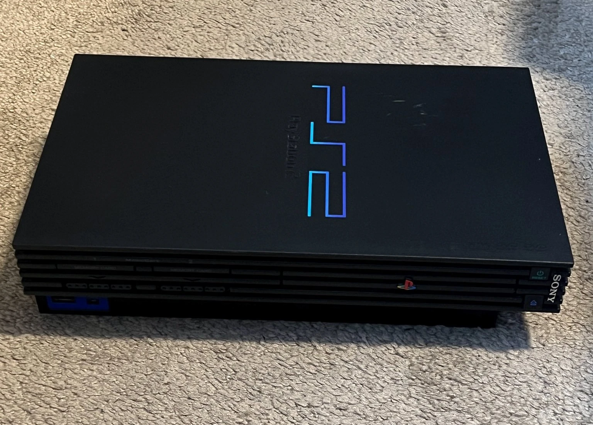

**Context:** Earlier this year, me and my partner got a Playstation 2 as a gift. Of course I wanted to softmod it! The console came with firmware 1.10U, an especially odd and early firmware version that did not work with the FreeDVDBoot exploit. I didn't know [FreeHDBoot](https://israpps.github.io/FreeMcBoot-Installer/test/FHDB-TUTO.html) when researching and writing this, which I ended up going with in the end. I gave up on this exploit port, and didn't succeed. I think there's still some value in this post anyway.

---

If you aren't familiar with [FreeDVDBoot](https://github.com/CTurt/FreeDVDBoot), it's an exploit developed by [CTurt](http://cturt.github.io/) who is a well known hacker also known for shogihax, PS4 hacking and other things. FreeDVDBoot is theoretically simple, it takes advantage of buffer overflow exploits in the DVD firmware of the Playstation 2 console.



Me and my partner were gifted a Playstation 2 on Christmas, and I found out it's _extremely easy to mod_! I have a "phat" version of the console, so it's exploitable using [FreeMCBoot](https://israpps.github.io/FreeMcBoot-Installer/) or FreeDVDBoot. Unfortunately, to use FreeMCBoot you need an exploited memory card - the only way to get one is to write one yourself from an already exploited console (or a memory card writer) and I didn't want to spend any extra money. FreeDVDBoot works, but has only had builds for DVD firmware 2.00 and up. Well it's good thing mine is:

Huh... **1.10U**!? It looks like my console was a really early US model (_SCPH-30001_). Unfortunately, the only way one of these models could have a higher firmware is flashing via a update disc that comes with the PS2 DVD Control Remote. Again, didn't want to spend any extra money, so I didn't want to go online and buy it.

Luckily, CTurt has mentioned in the FreeDVDBoot README that the exploit should _technically_ work on any DVD firmware from 1.00-2.10. So that's exactly what I'm setting out to do, after all there are traces of 1.10 support in the code.

> "It's still early in terms of support for different versions, check back here later. Hopefully over time other developers from the scene will also contribute support for additional DVD Player versions. The new exploit for 2.10 should be possible to port to all firmwares between 1.00 - 2.13 (Sony actually patched this one in 2.14 lol)."

At first I tried burning DVD-Rs, but it was a real hassle and also a waste since these aren't reusable. However, CTurst mentions that it's possible to force PCXS2 to load the DVD firmware needed to exploit:

> "I'd like to thank krHacken for helping me out with that first roadblock. It turns out that PCSX2 does support the DVD player; it just can't load it automatically since it's located in encrypted storage and PCSX2 does not support the decryption. There are public tools which can decrypt and extract the DVD player from EROM storage. It can then be repacked into an ELF for easy loading into PCSX2."

Being able to test it on a computer would speed things up greatly, so I decided to try loading the regular DVD firmware first. However, if you try to naively load a DVD into PCSX2, it will prompt that the "DVD Player is not set up". You can check the GitHub issue [here](https://github.com/PCSX2/pcsx2/issues/1981) discussing DVD player compatibility, but to sum it up - PCSX2 won't try to initialize or use the DVD player at all.

However, it is possible to load the DVD player ELF file (PCSX2 can easy load ELF files from the emulator menu) so let's figure out how to extract it from the firmware.

# Figuring out BIOS files

The PS2 BIOS is actually made up of numerous BIOS files. _"EROM"_, _"BIN"_, _"ROM0"_, _"ROM1"_, _"ROM2"_, _"MEC"_, _"NVM"_ and so on. People seem to get these mixed up online, so I believe this is what they actually are. You can't believe how hard it was to find a single source for this information, a lot of it is spread between forum posts and GitHub.

* **ROM0 [4MB]** is the main PS2 BIOS.
* **ROM1 [512KB]** contains languages and other DVD player gubbins.
* **ROM2 [512KB]** is extra language fonts, such as for Chinese characters.
* **EROM [3MB]** stands for "encrypted rom" and contains the encrypted playback software for DVDs[^1].
* **NVM [512KB]** is BIOS settings, which can be generated by a real PS2 or PCSX2.

However there are also _"BIN"_ files - which as far as I can tell - are actually **ROM0** files. There is another hiccup to look out for: why is **EROM** and **ROM1** separated, despite both dealing to the DVD player? This [GitHub PR](https://github.com/PCSX2/pcsx2/pull/6719) mentions that **ROM1** contains **EROM**, but was separated historically. So if you see a BIOS dump like this:

* **ROM0 [4MB]**
* **ROM1 [4MB]**
* **ROM2 [512KB]**

That it's also a valid dump. I wonder why BIOS dumping tools separated the **EROM** in the first place?

# Extracting the EROM

As the name implies, _"Encrypted ROM"_ means that EROM is encrypted. Luckily, [Michaël Jimenez](https://github.com/jimmikaelkael) developed a tool called [eromdir](https://github.com/jimmikaelkael/eromdir) that lets us extract the files contained in the EROM[^2].

Taking a look inside EROM, it looks like something like this:

```
$ ./eromdir -l dump.erom
erom size (hex): 0x001c0000 magic_token: ' J K L'
number of erom files: 2
DVDELF - 575984 bytes
UDFIO - 28681 bytes
```

If you're wondering why the file listing is different between models, eromdir's README has this to say:

> "Looking at late Playstation 2 models Encrypted ROM (7000x BIOS and above) will
list around 50 files, some files contains binary code for the DVDplayer, some
other files are gzip compressed resources.
Older models only had 2 files in their Encrypted ROM: DVDELF and UDFIO driver."

On the note of encprytion, you might be wondering how this is even "encrypted" if we didn't need to provide any keys? I took a cursory glance, and it looks Sony used XOR encryption and eromdir reverses the weak obfuscation it provides.

Now that we can extract DVDELF, it isn't a valid ELF file yet. It's an encrypted elf (KELF) and we need to feed it into [kelftool](https://github.com/xfwcfw/kelftool) to further decrypt it:

```
$ ./kelftool.elf decrypt DVDELF dvd.elf
```

# Running the DVD player in PCSX2

Now that we have the ELF, we can use the "Run ELF" function in PCSX2 and see if we can load up the DVD player:

Nothing? That's weird... oh wait - why would the PS2 _natively_ read ELF files? I found a tool called [ps2-packer](https://github.com/ps2dev/ps2-packer) which repacks the ELF into something the Playstation 2 can actually read. Doing that and using a real DVD to test, we can find that:

It still doesn't work. Hm. To make sure it isn't the fault of the CDVD plugin I'm using, I'll try booting a real PS2 game too:

Huh, no that worked. So why is it refusing to load my ELF still? Maybe it was due to the old build I was using of ps2-packer, so I attempted to use the Docker version:

Still no-go there. Time to start delving into forum posts! I came across a certain pastebin (FWZuKcs9) that has already rebuilt DVD ELF files. So I'll be using those instead, since mine were not playing nice with me. If someone knows how to properly repack DVD elfs, please [contact me](/contact) and I'll edit it into the article.

What's nice about the "legally acquired ELF files" that I have, is that it covers all DVD firmware versions so now it will be extremely easy to test! Here's one DVD elf showing that it does in fact, play back real DVDs inside of PCSX2:

One more problem, FreeDVDBoot doesn't seem to work inside of PCSX2.

[^1]: Why this is encrypted in the first place is unclear, this might be because the DVD format is proprietary and the standard is paywalled.

[^2]: You may have trouble building eromdir depending on how recent your autotools version is. If you have `bootstrap` yelling at you that it's too old, simply change line 37 and add your major version of autotools.
