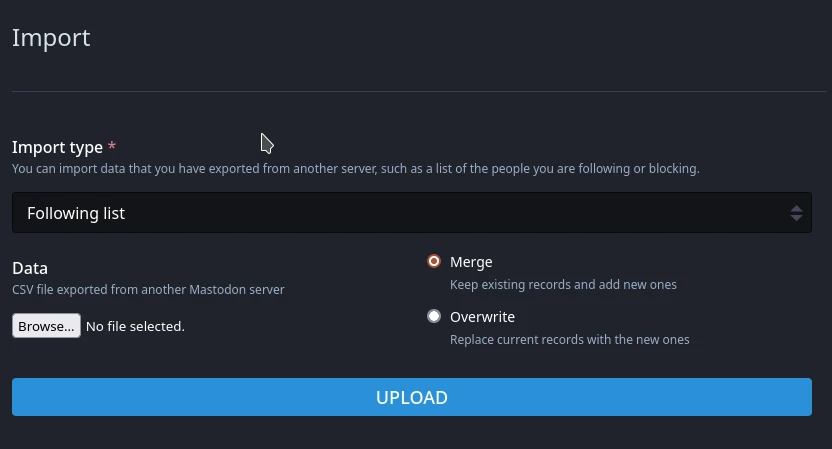
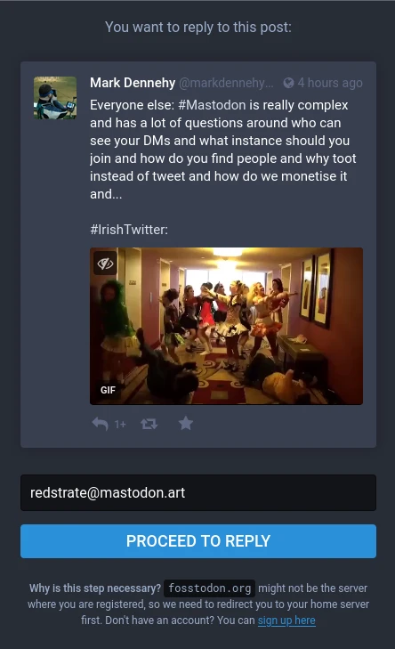
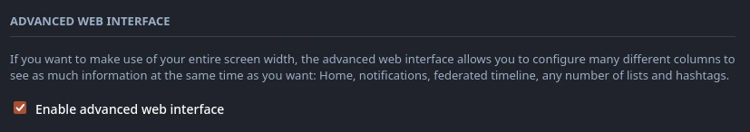
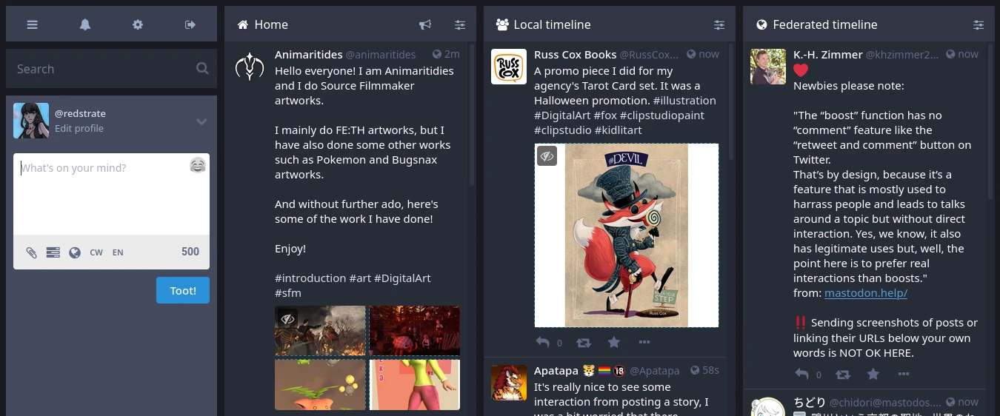
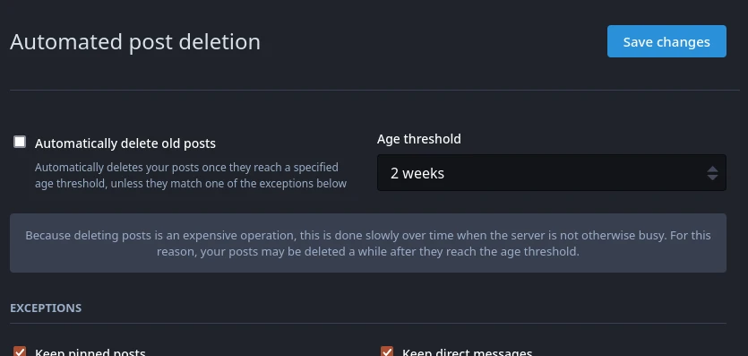
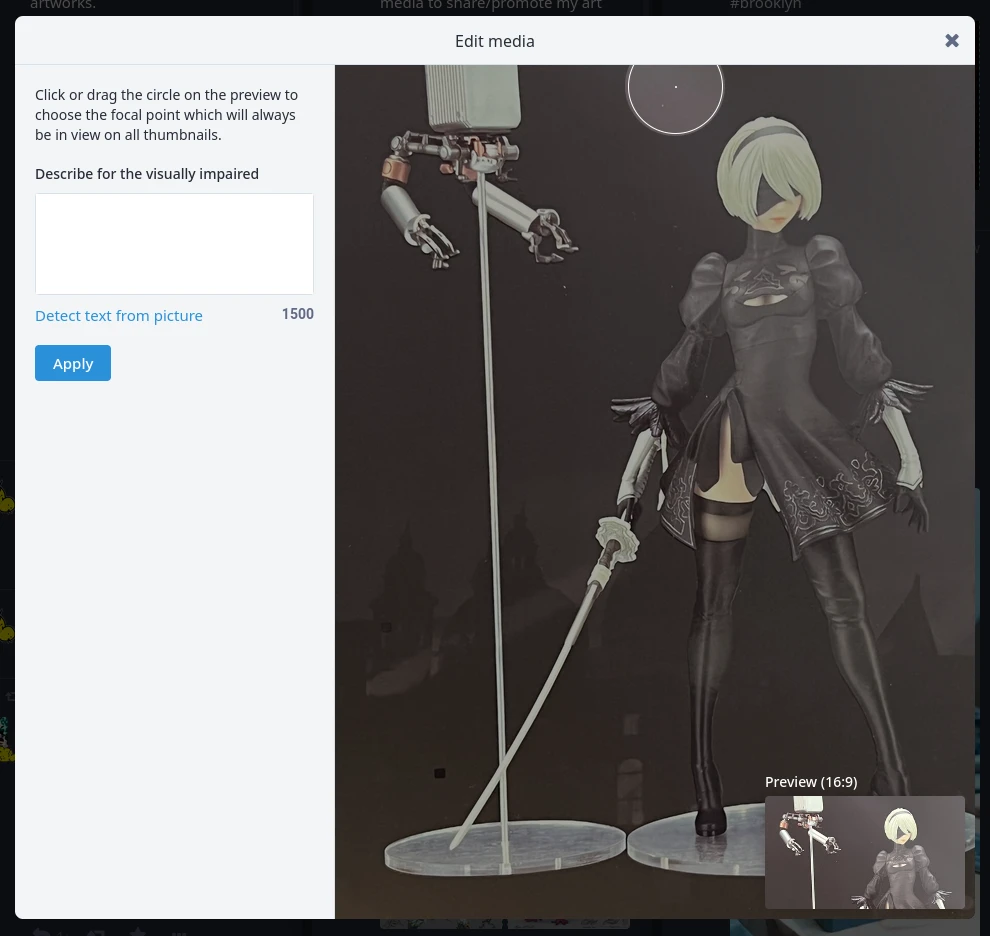

Seeing the "collapse" of Twitter (although that's overstated) means a lot more people are joining Mastodon so I wanted to collect all of my thoughts.
<!--more-->
The focus isn't what's going wrong with Twitter right now, but trying to clear up some common misconceptions about Mastodon and the Fediverse in general, following questions I've seen in the relevant Knockout thread.

# Mastodon is siloed, and general server moderation thoughts

A lot of people are naturally worried about the state of server ownership in the Fediverse world, and "siloing". To put it simply, people
don't trust server owners and they are generally worried about how some servers are blocked. A lot of people tend to go for the "email" approach to
explaining how servers work in the Fediverse, but it doesn't always work. In my opinion, the centralization of email (like social media) means that
people don't really know what to expect when you say "Fediverse servers work like email". I saw one person alluded to the fact that you have to be worried that servers might shut down, or be blocked randomly - but this works exactly the same as email. Let's look at this comparison:

* Imagine you are a "Birdsite" user, a popular mainstream and proprietary (as in you can only access it's users through it's own systems.) You are reported, banned or otherwise prevented from accessing the website. Thus, the website and consequently your user data is useless.
* Now imagine you are a Mastodon/Pleroma/Pixelfed user, and your server is blocked or you are reported and your account is disabled in some way. No matter, simply archive your data and restore it.

This is **why I think Mastodon wins**: If you don't have access to Twitter, there is basically no other way to interoperate with it. If your Mastodon server
gets theoretically blocked, whatever - just import your following list (or if your server is still accessible, transfer your followers too - a native feature of Mastodon) and keep going on with your day. Bookmarks, block lists, and other similar data can be imported as shown above. In most cases though, servers are blocked for a good reason (white supremacists, nazis, loli and other content usually make up most block lists). Most of the time the good of the server system outweights the negatives, and again if you ever feel like you don't fit in with your server - you can always move and take most of your things with you!

# Should I run my own server? Is it worth it?

I summarized this point in some random thread on Knockout, but wanted to explain it better here. In most cases, which is strange - I recommend not doing so. Here's why:

Mastodon federation is **not** retroactive.

This might not seem immediately obvious, but here's how it works: You spin up a new ActivityPub-compatible server (Mastodon, Pleroma, or other) and create a new account handle. Federation works as follows: you _must_ interact with a server first before it starts talking to you. The easiest way to get started is to start following accounts. Once you do, the server starts to open up to you and sending it's timeline, users, and posts your way. The more servers you interact with, the bigger your federated timeline becomes and more federated users are "known" to your server.

Unfortunately, this is where the problem lies therein - if you are spinning up your own Mastodon server _just_ for yourself - it's just not enough. If you want to see someone's profile locally, a lot of their posts will be missing, because most likely they created their account way before your server even existed. In an unfortunate twist, the longer a Mastodon server existed the more likely it will have "more" content, and more complete user profiles available. For Pleroma users especially, it's hard to interact with content that you are not initially federated to, because it lacks "reply gateways", something that Mastodon users can take advantage of:

Also as a single user Mastodon instance, it's going to be really hard to get going because the easiest way to start following accounts is by looking at the local and federated timelines, something that will be very barren or maybe non-existent for new servers:

Mastodon in general is designed (perhaps intentionally or not) for communities to form around multiple servers, and something like a single-user Mastodon instance is niche, and nigh unusable (in my opinion, as someone who has tried to run one before). In this way, it actually differs from hosting your own email.

# Other nice things to know

Here's some smaller Mastodon features that I think are neat:

* It's possible to hide your followers/who you are following - something that's always bothered me that it's public on Twitter:

* A nice three-column TweetDeck-esque view is available on Mastodon:

* It's possible to set up automated post deletion, for those who don't want to keep a permanent record of your thoughts:

* You can change where your images are cropped, if they are:

(If you don't know, on the web interface there's an option to disable cropping of non-expanded posts)
