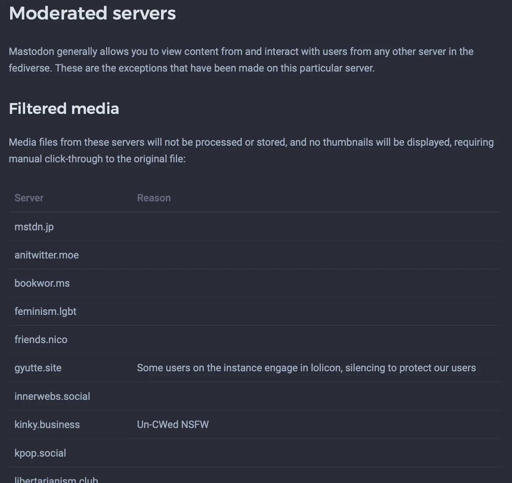
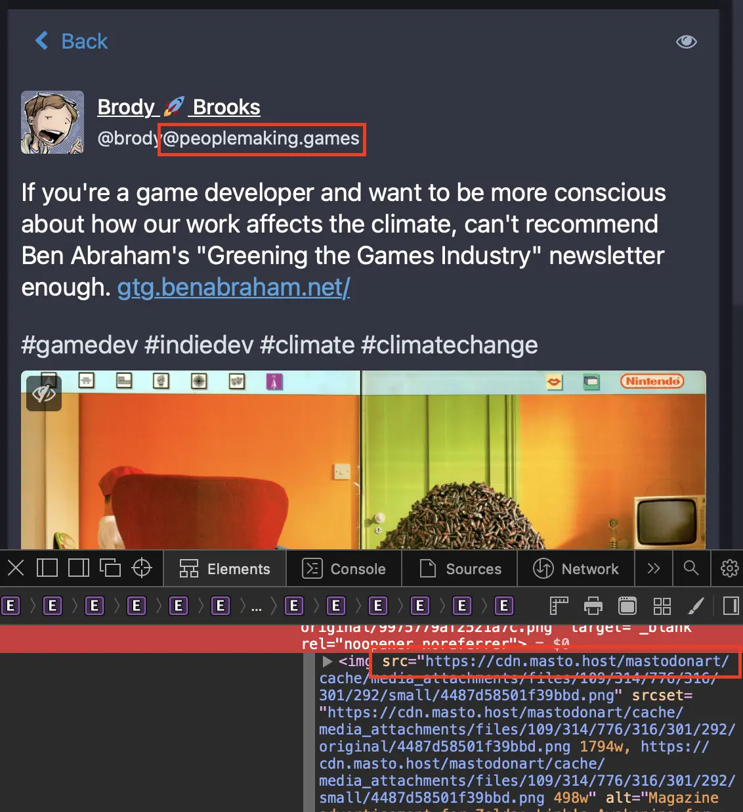

This is a continuation of my ['Thoughts and Tips on Mastodon"](), today we'll focus on blocking servers from federation.
<!--more-->
As more and more people are adopting Mastodon (welcome!), another feature they are worried about is federation blocking, also known as "fediblocking". Throughout the rest of this article, I will simply call this "blocking" - but remember this is applied to the _entire_ server, I'm not talking about blocking individual users. I decided to write this article because I haven't been able to find any real information, or opinions on this topic, which was really strange.

First let's dive into the three different types of blocking, which may be surprising to people who only thought there was only one. Go to any Mastodon instance that runs the official frontend, and go to their `/about/more` page, and they should have a list of blocked servers listed:

1. Filtered Media - this type of blocking is the least intrusive, as it simply does not process the media locally on the server. You will have to visit the post on the originating server in order to view it.
2. Limited Server - posts from these servers are hidden from the federated timeline, and interactions from their users will not generate notifications. This only applies if you are not following the user.
3. Suspended Server - these servers are completely blocked from federation, communication and interaction is impossible.

As you can see, there are three different classes of blocking and they range from least intrusive to destructive (in terms of interaction). As you can see, Mastodon's extensive moderation tools also extends to the server-level. However, it is a good concern that you want to follow users on another instance, but they are blocked on your server in some fashion. My current homeserver is Mastodon.ART, and they recently [published a post](https://www.patreon.com/posts/74436103?pr=true) describing their opinions on the issue:

> It's .art's policy that we defederate from instances that host Nazi/alt-right/fascist content, *and* from instances that federate with such content, on the premise that, 'If you make space for Nazis, I don't make space for you'. This is one of our core values, a reason many people choose our instance, and an important tool for taking hard stance against fascism. It is non-negotiable.

> There was a period recently where reports about users on mastodon.social were getting actioned more quickly, and for a while it looked like they might actually be making a conscious effort to increase their moderation - but that no longer seems to be the case. It has come to light that mastodon.social now only has one moderator, and that moderator is Gargron - the owner.

> So we're going to keep federating with mastodon.social. But maybe, if your friends are there, encourage them to find a safer home on the fediverse that has an actual team of moderators that collaborate on decisions, and who will make a better effort in protecting their users from fascists.

As you can tell, they do not want any interaction with "fascist", "alt-right" servers in any capacity. For people not familiar with how federation functions, may see this as an egregiously specific political stance to take, but remember that these servers are run _by people_, not by corporations[^1]. These people decide what explicitly is allowed on their server, and these _apply_ to the servers they choose to federate with. This is just something to keep in mind when picking a homeserver.

> 1. Federating with Mastodon.ART is not guaranteed. Links between federated instances are temporary and may change or disappear at any time.

> 7. We will block, suspend, or silence any instance which permits any of the content or behaviour prohibited by this instance.

(Excerpt from [Mastodon.ART's Federation Policy](https://mastodon.art/about/more#federation-policy))

As you can see, they consider federation to be a "privilege", not a "right". While I agree that federation is the future, it's important to remind people that federation is not a solution to "free speech" but instead a function at your server moderator's discretion. The same Terms of Service that dictates the content on their server, also applies to any servers that federate with them. To see how this how could be an issue, take a look at this hypothetical situation:

1. You set up a server A, which does not block any servers. You want to be able to federate with as many servers as possible, and the home servers you have previously been a part of has blocked instances you wanted to see[^2].
2. As server A federates with your chosen followed users, your federation network naturally expands.
3. Server B comes in, since you are following someone on that server. Server B has very little restrictions on the allowed content, or a lack of moderation.
4. One of server B's users start posting illegal content, which you don't have control over due to them not being on your instance.
5. Since you do not block their instance, the illegal content is now _rehosted on your server_. This is just how federation functions.

As you can tell, without proper moderation of either server - it becomes especially troublesome.

(As you can see, despite this post originating from another server, it is rehosted by mastodon.art. This is how potentially illegal content can easily propagate if your server is not careful[^3].)

Depending on the country your server is hosted in, this can land you in very, very hot water. Because of this, big Mastodon instances have to be very, very careful with who they interact with. As the Mastodon network grows, this will be a growing issue[^4]. This is why I don't take immediate issue with how Mastodon.ART operates, because as soon as they slip up they could hurt themselves, their users, and by consequence the servers they federate with. The well-being of the whole federation depends on the moderation of its individual servers[^5].

[^1]: Not to say that something like Twitter _isn't_ run by people, who are part of a greater corporation - but stuff like Mastodon.ART are run by people I could easily get in contact to if need be. Getting a hold of a real human on Twitter, Youtube is next to impossible. The moderation team behind Mastodon.ART is also leagues smaller by even the smallest of social media companies.

[^2]: I highly suggest not spinning up your own server in order to sidestep blocked servers.Bigger instances now block servers that federate with their blocklist (willingly or not). I highly suggest to bring it up with your homeserver moderator instead, to see if they can reconsider their position if you believe it is in error.

[^3]: This is something that "Filter Media" blocking could fix, but I'm guessing servers that allow hosting of potentially illegal content also have lax moderation in general, allowing saucy text content to come through as well. This is especially troublesome for moderators that can only read English, limiting their ability to accurately assess certain servers. This is a greater moderation issue in general though, and not something specific to Mastodon.

[^4]: Here I'm referring to the general Mastodon network, which includes most of the major servers listed on joinmastodon.org. Due to how federation functions, there is nothing stopping a private Mastodon network from being created, however I don't know of any yet.

[^5]: In my opinion, this is one of the better parts of the federation - but also its downfall. With centralized, proprietary services like Twitter you are at the mercy of its moderation teams - who probably don't even have any control over the policies they enforce (those are refined by their legal team, approved by executives and suggested by board members). However, since most Mastodon servers are hosted by just regular people, they get to decide how their server is moderated. Consequently, this makes moderation _easier_ because you can hire moderators at will, and it's easier to divide and conquer since you just have to worry about your server population. However, this works in the reverse - your server can easily outgrow your moderation team (apparently Mastodon.social only has one moderator, for example) the situation can get much, much worse and the only real solution is to block the offending server entirely.