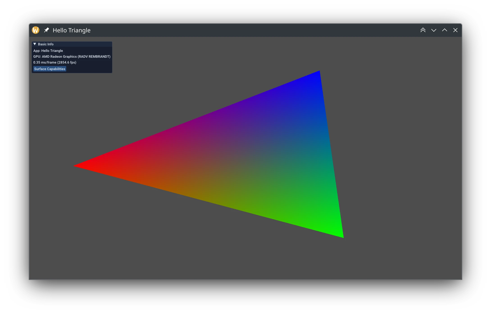

I wanted to enable server-side decorations in a Wayland client, but didn't know where to start. When searching for _"How to enable server-side decorations wayland"_ in a search engine you get a lot of user support questions and not really anything for programmers. Here's a short tutorial on how to request server side decorations from the compositor if supported.

# Which protocol to use?

When searching for the Wayland protocol to use, you'll come across two different ones:
* [kde-server-decoration](https://wayland.app/protocols/kde-server-decoration)
* [xdg-decoration](https://wayland.app/protocols/xdg-decoration-unstable-v1)

What is the difference between the two? From what I can tell the first extension was by KDE and put into their protocol collection. It doesn't appear to be used anymore, and not even installed on my system. xdg-decoration is actually in wayland-protocols (albeit unstable) so we'll use that one.

If you're using ECM ([Extra CMake Modules](https://invent.kde.org/frameworks/extra-cmake-modules)) then use `ecm_add_wayland_client_protocol` to generate the header:

```cmake
ecm_add_wayland_client_protocol(
    WAYLAND_SOURCES
    BASENAME
    xdg-decoration-v1
    PROTOCOL
    ${WaylandProtocols_DATADIR}/unstable/xdg-decoration/xdg-decoration-unstable-v1.xml
)
```

# How to use xdg-decoration

When enumerating the global registry, bind the `zxdg_decoration_manager_v1` struct using the `zxdg_decoration_manager_v1_interface` interface:

```cpp
auto manager = reinterpret_cast<zxdg_decoration_manager_v1 *>(wl_registry_bind(registry, id, &zxdg_decoration_manager_v1_interface, 1));
```

Using the decoration manager, you want to [set the "mode"](https://wayland.app/protocols/xdg-decoration-unstable-v1#zxdg_toplevel_decoration_v1:request:set_mode) of the decoration to either client side or server side:

```cpp
auto decoration = zxdg_decoration_manager_v1_get_toplevel_decoration(manager, toplevel); // toplevel is from xdg_surface_get_toplevel

zxdg_toplevel_decoration_v1_set_mode(decoration, ZXDG_TOPLEVEL_DECORATION_V1_MODE_SERVER_SIDE);
```

And that's it, you'll get server-side decorations enabled for your client:



There's one more part of the extension I didn't cover, and that's the ["configure" event](https://wayland.app/protocols/xdg-decoration-unstable-v1#zxdg_toplevel_decoration_v1:event:configure). According to the protocol spec, it's possible that the compositor will change the decoration mode from underneath your feet. Is this something that actually happens in real world Wayland compositors? I can't imagine this happens often, although I'm curious if you've heard of this.
