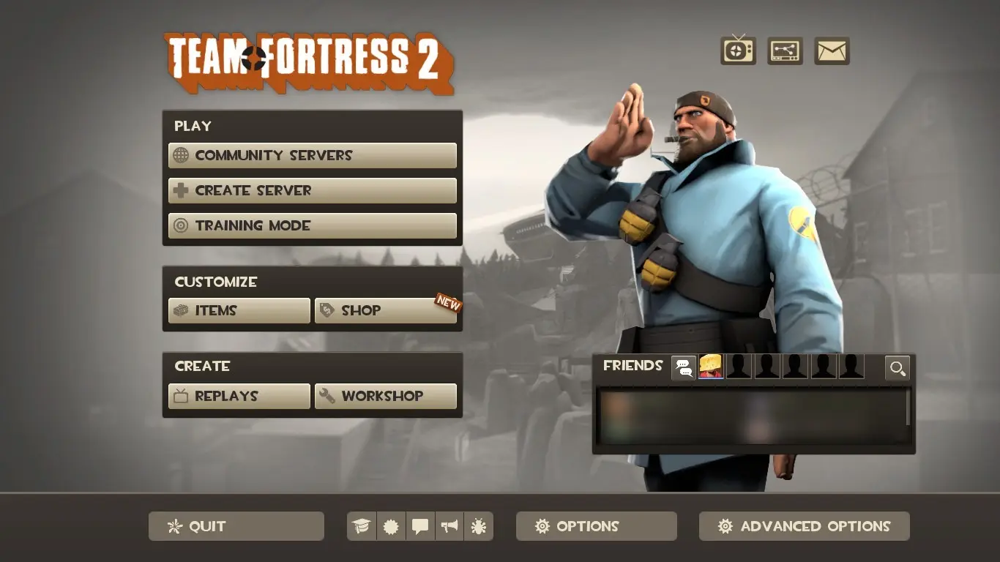



I host downloads for things that I either want to archive, or worried we might lose.



## Source Map Archive 

https://archive.ryne.moe/source

I host a mirror of the [Source Map Archive](https://knockout.chat/thread/32805), provided by some users on Knockout!

## TF2 2012 Main Menu

This is a redistribution of CblpBoPTy's TF2 mod series unofficially called "PotatoHud".

Unfortunately, they have stopped modding:

_"hi, i closed the projects and don't do modding anymore. I lost the necessary knowledge, and now I can not update my mods, besides, there were many bugs that I could not fix. I don't play tf2 much anymore and games in general. I am doing a different job. Sorry friend, but there will be no more updates."_ (from their [Steam profile](https://steamcommunity.com/id/CblpBopTy))

Unfortunately I like their HUDs too much for it to go to waste, so fortunately there was _one_ version they forgot to private and I have it permanently archived [here](https://git.sr.ht/~redstrate/tf2-2012-menu). Right now, their mod is licensed under _"Creative Commons Attribution-NonCommercial-NoDerivs 4.0 Unported"_ so while I can technically redistribute this version, I cannot modify it. However the mod still works on recent game versions as of Scream Fortress 2022.

## XC2 Graphics Settings Mod

This is a romfs mod that tweaks the graphics settings of Xenoblade Chronicles 2. By default the game looks over-sharpened and downscales the image a lot. This is especially problematic for emulators since you typically want a better image quality than the Switch.

This work was originally pioneered on [GBATemp](https://gbatemp.net/threads/xenoblade-chronicles-2-graphics-settings.529436/) but I wanted to archive my own version, tweaked specifically for emulation. The original file is based off of the "Raw Image > Max 720p" preset included in the original Profiles.zip.

You can download it [here](https://git.sr.ht/~redstrate/xc2-graphics-mod).
