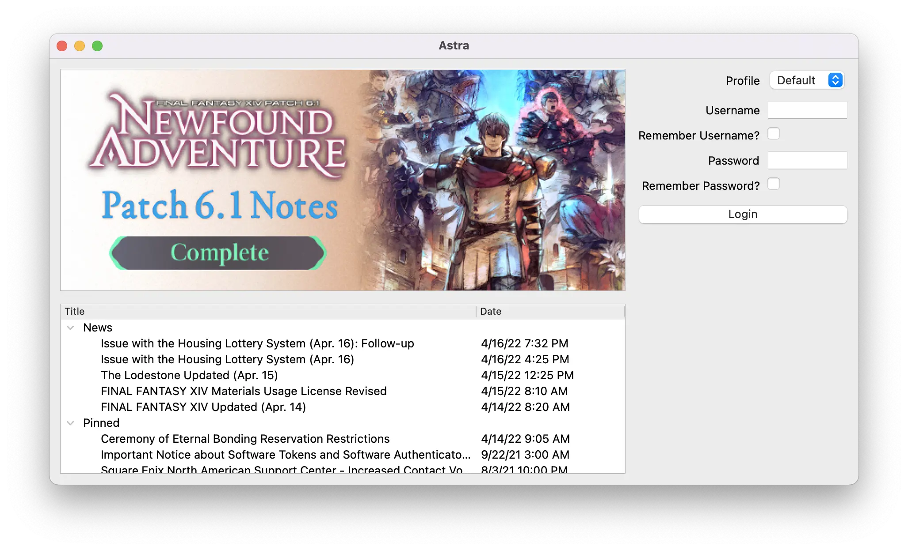

Cross-platform FFXIV launcher, designed for Wine users.

<!--more-->
---

A custom FFXIV launcher that supports multiple accounts, [Dalamud](https://github.com/goatcorp/Dalamud) plugins and runs
natively on  Windows, macOS and Linux!

## Features

* Traditional desktop interface which looks native to your system, utilizing Qt - a proven application framework.
    * Supports single-window scenarios such as the Steam Deck seamlessly.
* Native support for Windows, macOS and Linux!
* Handles running Wine for macOS and Linux users - creating a seamless and native-feeling launcher experience, compared
  to running other FFXIV launchers in Wine.
    * Can also easily enable several Linux-specific enhancements such as Fsync or configuring Gamescope.
* Multiple account support!
    * Most settings can be set per-profile.
* Easily install and use Dalamud plugins, just like XIVQuickLauncher.
* Patches the game, just like the official launcher!
* Securely login to the official Square Enix lobbies, as well as Sapphire servers.
    * Game arguments are encrypted by default, providing the same level of security as other launchers.
    * Saving account usernames and passwords are also supported, and is never stored plaintext.
* Can easily install FFXIV on new systems right from the launcher, bypassing the normal InstallShield installer.

You can read more about it on [xiv.zone](https://xiv.zone/astra).
