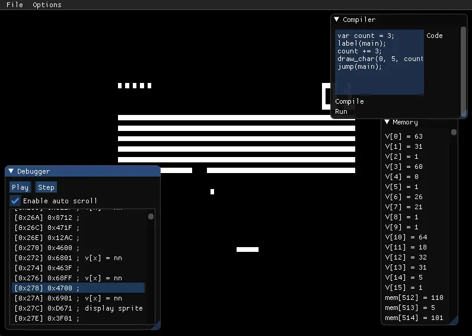

This is my first ever (working) emulator, of the simple CHIP-8 system. I'm pretty proud of this, because apart from the sprite collision logic I was able to implement most of the opcodes just looking at a basic overview of the instruction set.

Technically, this implements the SCHIP type of instructions but can still play many of the ROMs you can find online. I also added a cute debugger window and a memory viewer. The emulator also comes with a built-in deflicker for the display.

For funsies, I included a basic parser that can spit out valid CHIP-8 instructions for a C-style language!
