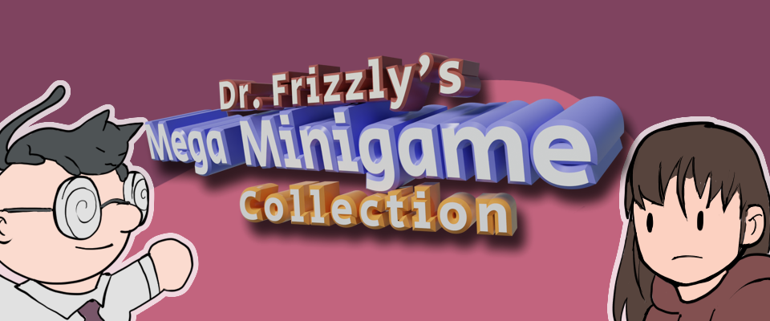
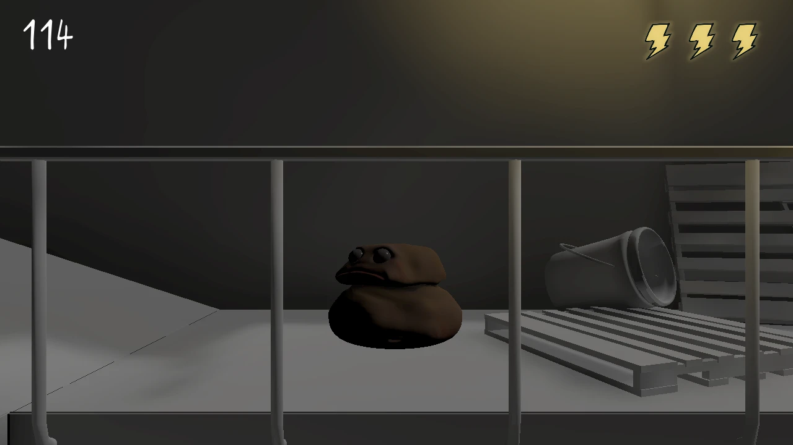
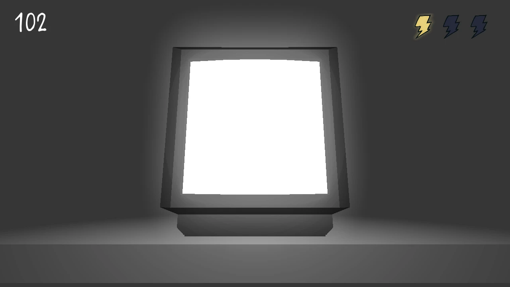
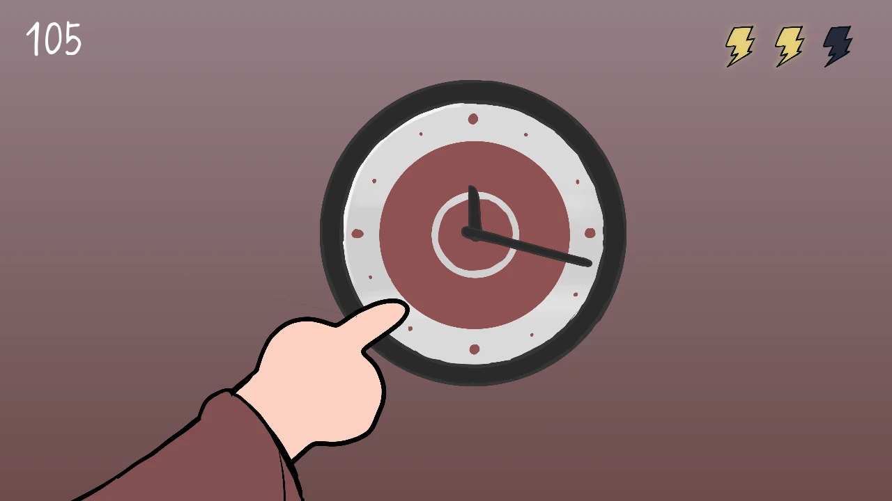

Dr. Frizzly has invited himself (into your house) and has a new game - Dr. Frizzy's Mega Minigame Collection! Complete as many minigames as you can before the 120 second time limit runs out.

This is my game jam entry for the KO Slam-Jam, which happened over the course of
three days. It's not great, and eventually I'll update it and release the source code.

You can view the full game page on [itch.io](https://redstrate.itch.io/dr-frizzlys-mega-minigame-collection)!
