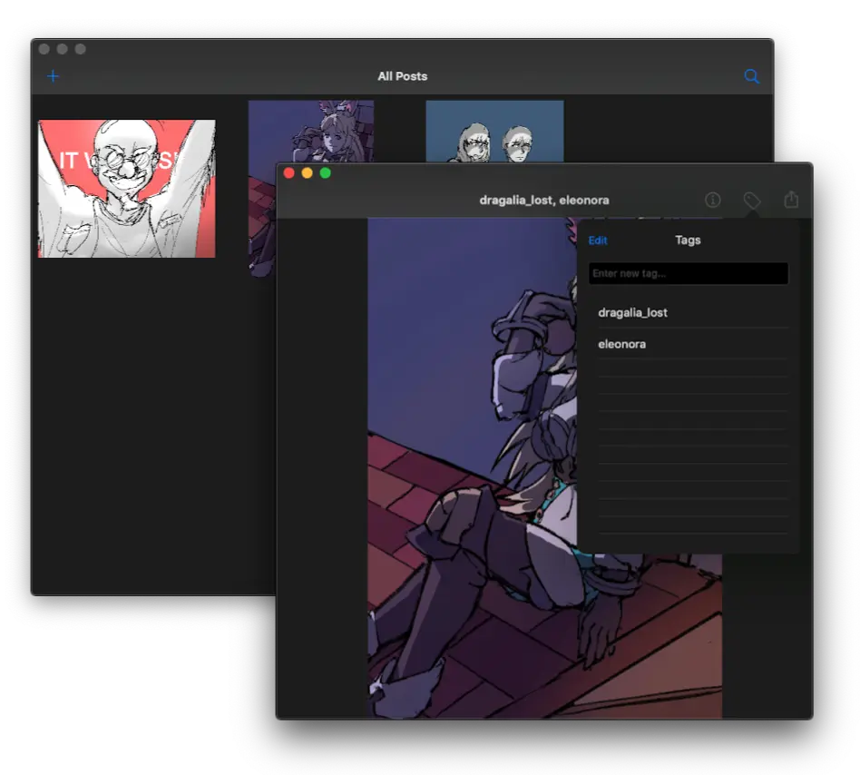

I had always wanted to build a local booru application, especially for Apple devices. This was also an experiment in Mac Catalyst, which released the same year.

This utilizes UIKit for it's GUI, and uses Apple's own Core Data framework to actually build relationships between tags, images, etc. To run on macOS, it uses Mac Catalyst. The actual functionality of this is incredibly basic, but it does work!
