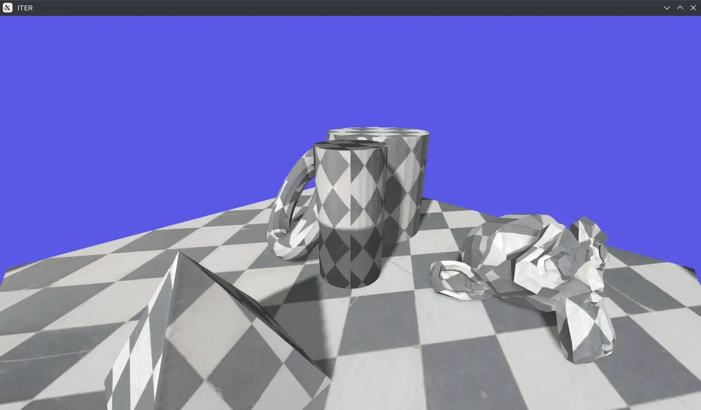

Following up [XT](), this was my first adventure into Vulkan - which was a relatively new API at the time. This is an ancient project, but this is where the majority of my Vulkan knowledge was born from. Unlike some of my older projects I've recovered recently, this one actually has **all** of my commit history intact!

This features things such as:
* Working depth of field pass utilizing near and far fields.
    * This was started back when the engine was originally conceived, but I actually finished this feature recently :-)
* Custom Qt interfaces for all the tooling, compared to the dear imgui interfaces of Prism and XT.
* Antialiasing utilizing SMAA.
* Audio playback using OpenAL Soft.

This was eventually replaced by [Prism]() in 2020 and onward
