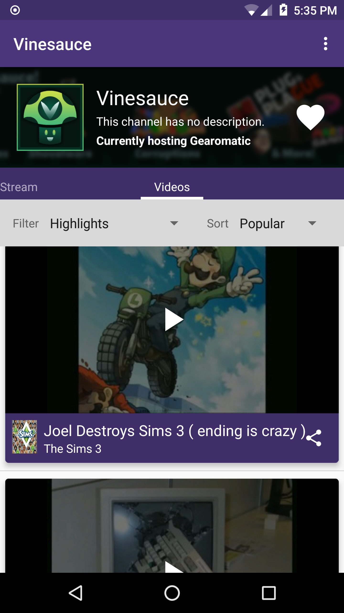

## Features
* Watching livestreams with chat
  * Ability to use external player like VLC with quality options
* Watch videos
* Search livestreams and channels
* Follow channels
  * Notifications when followed channels go live

