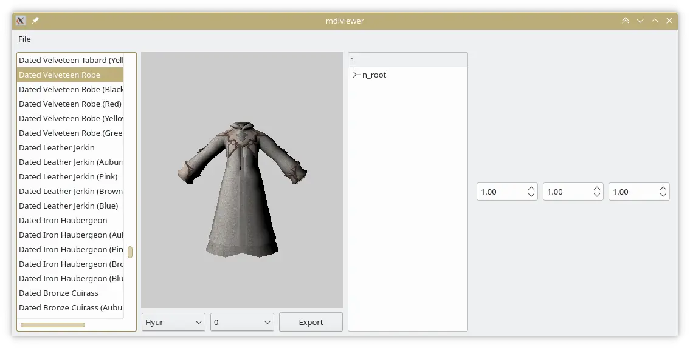

This is a collection of cross-platform, FFXIV modding tools. These don't use any pre-existing modding framework (Lumina,
xivModdingFramework, etc) but instead my own custom modding library, [libxiv](https://git.sr.ht/~redstrate/libxiv).

The goal is to create a good set of tools that isn't based on WPF and C#, and can work cross-platform without having
to resort to Wine.

You can read more about it on [xiv.zone](https://xiv.zone/novus).
