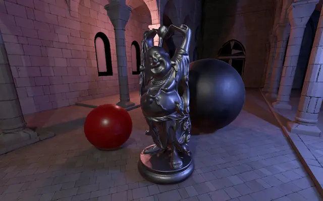

Cross-platform game engine specializing in the real-time rendering of physically-based graphics.

<!--more-->
---

This engine is the summation of all of my graphics developer knowledge. The list of features is not limited to:

* Physically based rendering and image based lighting based on scene probes or from a dynamic sky.
* Skeleton and also a basic cutscene system.
* Custom editors to edit the most common assets, such as materials and maps.
* Beautiful shadows using a runtime configurable option of PCSS, PCF or just plainly sampled.
* Scalability options including turning off all image based lighting or toning down point light shadowing which can run on lower end devices such as a phone.
* Advanced render interface layer that can run on top of Vulkan, Metal and eventually DirectX.
