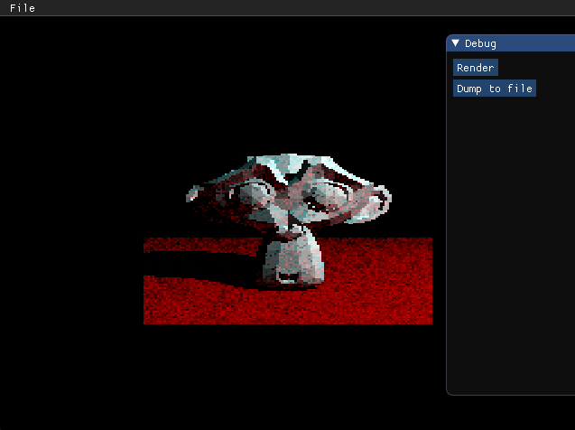

CPU raytracer.

<!--more-->
---

This is a CPU-based raytracer, and also my first! This features things such as:

* Naive multi-threading support based on tiles and utilizing C++ futures.
* Ability to load arbitrary OBJs and render them.
* Indirect light sampling.
* Shadows!!
* dear imgui interface for easily viewing the results.