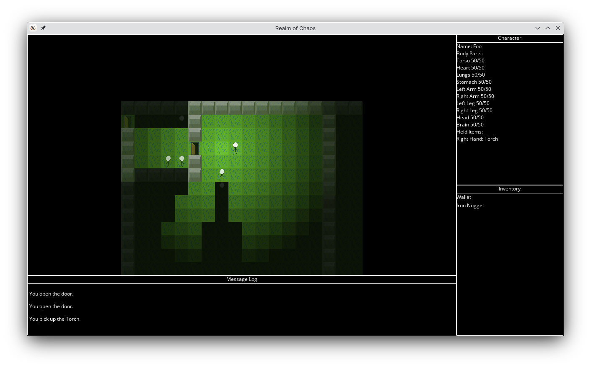

Rogue-like game with a couple of interesting features.

<!--more-->
---

This is my attempt at building a rogue-like game for the first time, but I'm pretty happy with it's feature set. The whole thing is still full of programmer art.

For example, it features **multiplayer** that is actually turn-based but does function! There's also a dynamic lighting system that can be interacted with in-game by picking up or throwing a torch - for example.

The combat is also based on hacking off parts of your victim, but you could also try to influence them by talking and interacting with them. The AI is advanced enough to also chase after you, utilizing A* pathfinding.