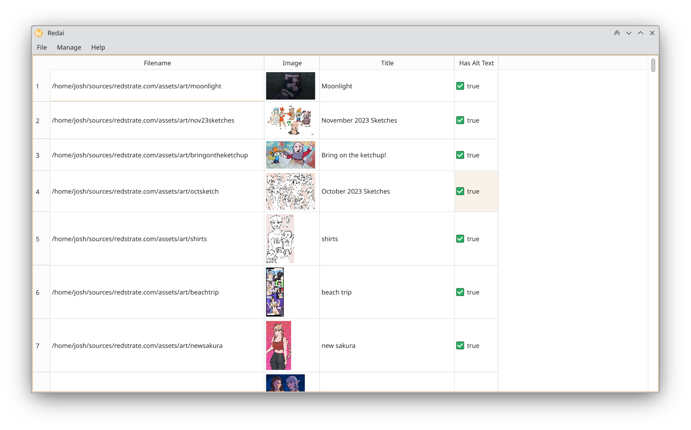

The art gallery manager application for this website! It can edit piece information such as title, date, description and more. You also have a nice preview of the art when editing, which helps writing alternative text.

