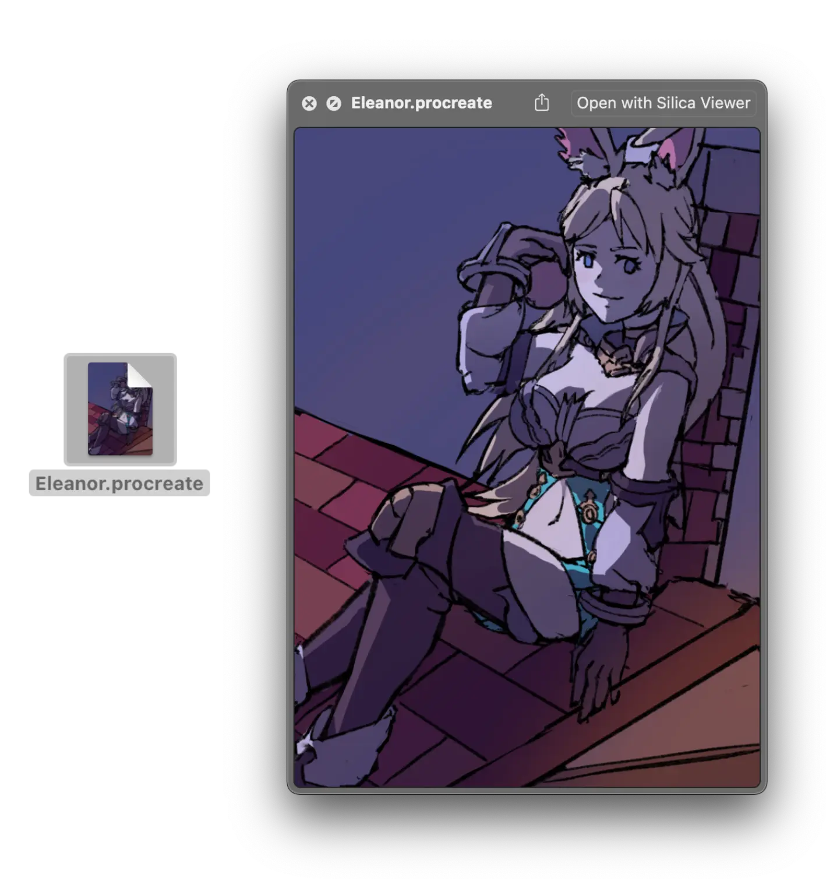





## Frequently Asked Questions

### Can I see my timelapse?

**Yes** you can! Once you open up a document, look under the `View` menu where you'll find a `View Timelapse` option. A new window will show and begins playing your timelapse.

You also have the ability to export your timelapses, under the `File` menu. Right now it is limited to your full timelapse, but this will be addressed in a major update.

### Can I see how long I've spent on my artwork?

**Yes** you can! Once you open up a document, look under the `View` menu where you'll find a `View Info` option. A popup will show that says how much time you've spent and some other statistics about your artwork.

### Are you displaying my artwork in it's full resolution?

**Yes!** Silica Viewer can render your canvas just like the Procreate© app does and even lets you export your art at full-size resolution.

### Can Silica Viewer export my artwork as PSD so I can save my layers?

Yes it can! Please note that **mask layers** will not show up as proper mask layers, but it will still retain the pixel data so you can fix it yourself. This functionality will be fixed in a future minor update.

### Help, my colors look off even when I export it to another format!

The **lack of proper color profiling** is one of the last missing features of Silica Viewer. Right now I don't perform any color transformations manually, so you may be able to manually convert color spaces in your preferred image editor.

This functionality will be addressed in a future major update.

### How much does Silica Viewer cost?

Silica Viewer is **$0.99 on the Mac App Store**, solely to help cover the costs of my Apple Developer license. Thank you for purchasing my software, it means a lot to me :-)

### Is there a free or demo version?

I do not provide an official binary outside of the App Store, for the reasons above. However, the
code is fully open-source, and you can find it [here](https://sr.ht/~redstrate/silica-viewer). It should build out of the box in Xcode.

### Can I purchase Silica Viewer somewhere else?

I do not have any plans to sell Silica Viewer anywhere else at the moment.

### Does this app collect any data?

**No!** The only analytics I recieve (and I cannot turn off) is those collcted by Apple - such as crash reports. The app is designed to work inside of the secure macOS sandbox. More information is available in my [imprint]().

### Is there a Windows or Linux version planned?

Not at the moment.

### Why are my thumbnails not generating?

If you've just installed Silica Viewer, please allow some time for macOS to start creating thumbnails. This is something I can't control, but on my system it takes about 1-2 minutes for it to start creating thumbnails for my documents.

### Nothing is working! Please help!

If you encounter any issues, bugs, and have bought Silica Viewer from the Mac App Store - please contact me at josh@redstrate.com.

## Copyright

_Procreate® is a registered trademark of Savage Interactive Pty Ltd. Silica Viewer and its developer has no affiliation with Savage Interactive Pty Ltd._

Silica Viewer has no reference, or references to any trademarked material belonging to Savage Interactive Pty Ltd.

Silica Viewer uses only public Apple APIs.
