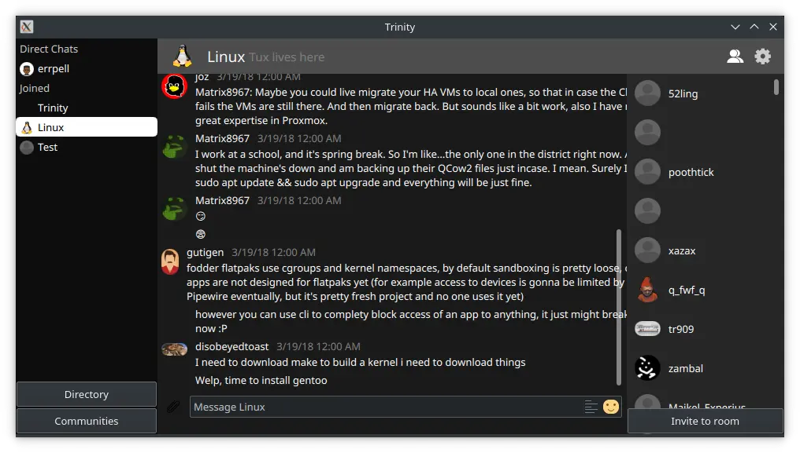

I was super interested in Matrix back in 2018, and thus
was determined to create a client similar to Discord that
could help users who were looking for a similar experience. Trinity was born, and I learned a ton about the Matrix specification and Qt/QML development from this project.

Unfortunately I could only recover an older version of the source code, but it's still completely functional today. However, The commit history is wiped clean. It used to feature some stuff that didn't exist in some of the most popular Matrix clients back then, such as audio/video calling (using WebRTC) and custom emotes.
