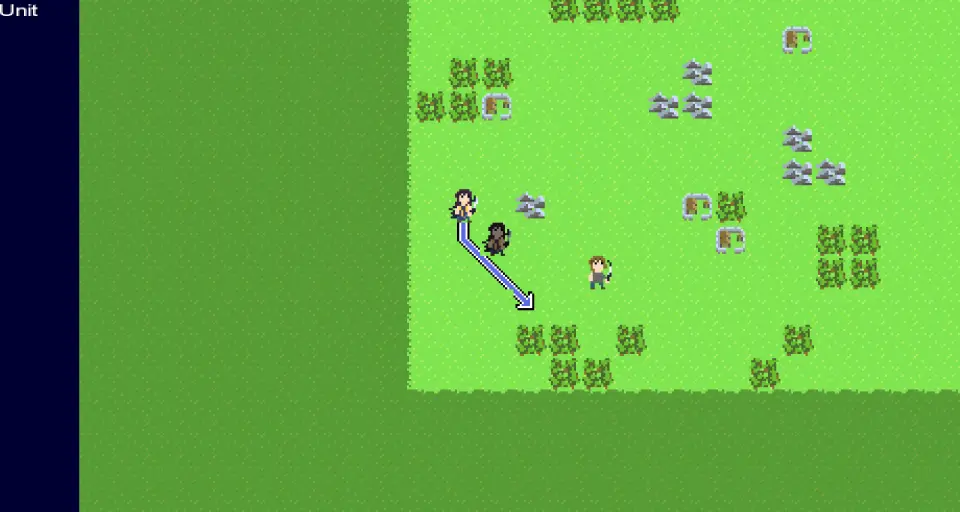

A really bare-bones Fire Emblem clone using libGDX and Java.

# Features

* Proper A* navigation for enemies, and is also player unit pathing.
* All the assets are wholly created by me, except for the default Arial font included in libGDX.
* Working gameplay loop, allowing you to kill or be killed by the enemy units on a test map.
* Maps can be created in Tiled, allowing for easy authoring.
