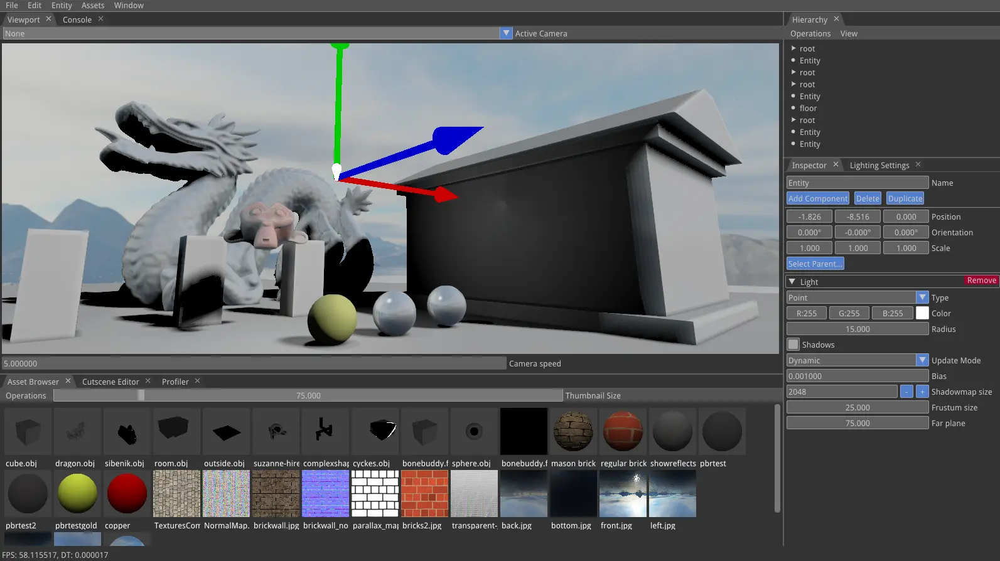

This was one of my first custom game engines, and my first foray into using OpenGL for a serious project. Unfortunately, I have lost all the source code, but the image below is what I was able to save from a dear imgui screenshot thread.

From what I remember, it had the following features:
* Custom editor using dear imgui 
  * The dear imgui tabs were based off of the [Lumix engine](https://github.com/nem0/lumixengine) since the docking branch did not exist at the time.
  * The editor also had auto-generated previews as shown for models, textures, and materials.
* Skybox support using cubemapping, this was also used for lighting my "PBR shader" (hint: as you can tell in the screenshot, I didn't know how to gamma correct anything in 2016.)

This is succeeded by my first Vulkan game engine, [Graph](). 
